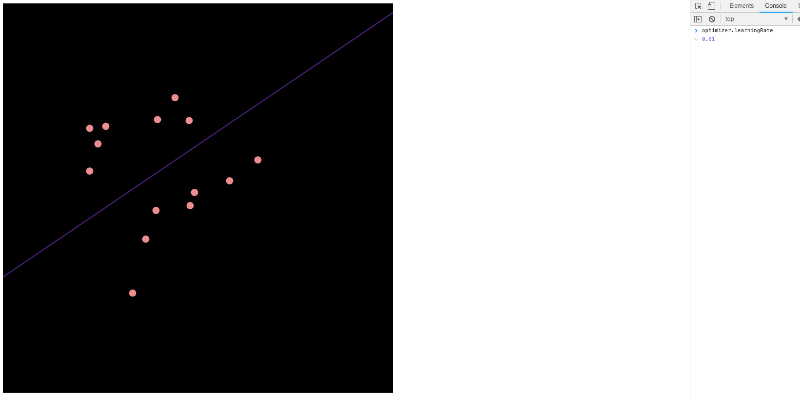

# AI Examples 📗

AI examples build with p5 and TensorFlow.js

## Linear regression 

Basic implementation of Linear regression with neural network.
Representation and training with mouse click as a dataset input

## Polynomial regression 

Polynomial regression with neural network.
Representation and training with mouse click as a dataset input

### How to use it?

* Open <example>/index.html
* Enjoy and play ;)

### LICENSE

> TensorFlow.js [License](https://github.com/tensorflow/tfjs/blob/master/LICENSE)

> P5.js [License](https://github.com/processing/p5.js/blob/master/license.txt)